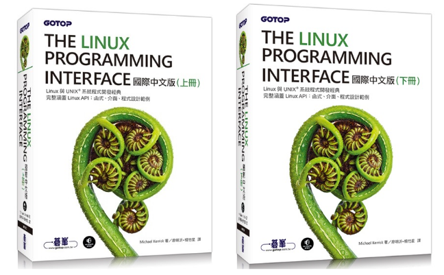

# 基本資料

作者：[Michael Kerrisk](https://man7.org/) 譯者：[廖明沂（Aaron Liao）](https://www.linkedin.com/in/aaron-liao-bb50b6147/)、[楊竹星（Chu-Sing Yang）](https://www.itlab.ee.ncku.edu.tw/csyang/professor.html)

出版社：碁峯資訊（[上冊](http://books.gotop.com.tw/v\_AXP015800)、[下冊](http://books.gotop.com.tw/v\_AXP015900)）

範例程式：[http://man7.org/tlpi/code/index.html](http://man7.org/tlpi/code/index.html)

<figure><figcaption></figcaption></figure>
